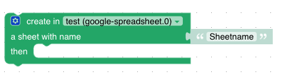

# Create-Sheet

➡️ See the [sendTo API documentation](../sendTo-API.md) for general usage and all available commands.
The create-sheet feature allows you to add a new sheet to a Google spreadsheet.

Used API endpoint: https://developers.google.com/sheets/api/reference/rest/v4/spreadsheets/batchUpdate

The feature accepts the following parameters:
- `sheetName`: The name of the new sheet to be added.
- `alias` (optional): The spreadsheet alias if you have multiple spreadsheets configured.

**Callback result:** `{ success: true }` on success, or `{ error: string }` on failure.

## Blockly



In Blockly, the parameter `sheetName` is passed as the title-parameter to the Google API. This title-parameter is used to name the new sheet that will be added to the spreadsheet.

## Javascript

The given code snippet adds a new sheet to the spreadsheet with the specified title.

```javascript

sendTo(
  "google-spreadsheet.0",
  "createSheet",
  { sheetName: "nameOfNewSheet" }
);
```
