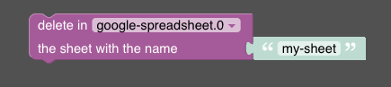

# Delete Sheet

➡️ See the [sendTo API documentation](../sendTo-API.md) for general usage and all available commands.

The delete-sheet feature allows you to delete a specific sheet from a Google spreadsheet.

Used API endpoint: https://developers.google.com/sheets/api/reference/rest/v4/spreadsheets/batchUpdate

The feature accepts the following parameters:
- `sheetName`: The name of the sheet to be deleted.
- `alias` (optional): The spreadsheet alias if you have multiple spreadsheets configured.

**Callback result:** `{ success: true }` on success, or `{ error: string }` on failure.

## Blockly



In Blockly, the parameter `sheetName` is passed to the Google API.

## Javascript

The given code snippet deletes a sheet from the spreadsheet with the specified name.

```javascript
sendTo(
  "google-spreadsheet.0",
  "deleteSheet",
  { sheetName: "nameOfSheet" }
);
```
