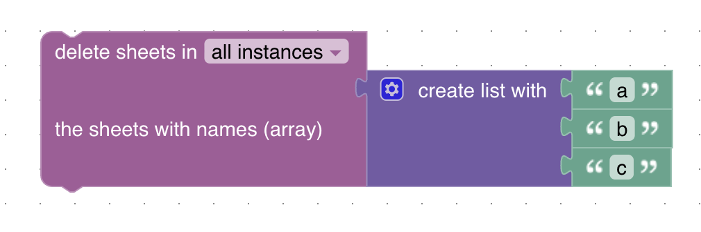

# Delete multiple sheets

➡️ See the [sendTo API documentation](../sendTo-API.md) for general usage and all available commands.

With the `deleteSheets` block you can delete several sheets from your Google Spreadsheet at once.

## Blockly



Use the block **delete sheets in [instance] the sheets with names (array)** and provide an array of sheet names, e.g. `["Sheet1", "Sheet2"]`.

## JavaScript

You can also call the function directly:

```javascript
sendTo("google-spreadsheet.0", "deleteSheets", { sheetNames: ["Sheet1", "Sheet2"] });
```

## Parameters

- **instance**: The instance of your google-spreadsheet adapter.
- **sheetNames**: An array of strings with the names of the sheets to delete.
- **alias** (optional): The spreadsheet alias if you have multiple spreadsheets configured.

**Callback result:** `{ success: true }` on success, or `{ error: string }` on failure.

## Example

```javascript
sendTo("google-spreadsheet.0", "deleteSheets", { sheetNames: ["Log", "Backup"] });
```

This will delete the sheets named "Log" and "Backup" from your spreadsheet.

