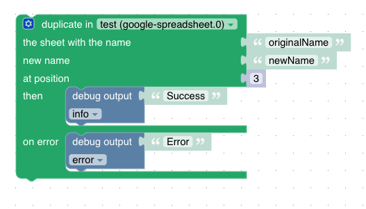

# Duplicate Sheet

➡️ See the [sendTo API documentation](../sendTo-API.md) for general usage and all available commands.

The duplicate-sheet feature allows you to create a copy of a specific sheet in a Google spreadsheet. This can be particularly useful when you have a sheet that serves as a template. By duplicating the template sheet, you can preserve the original while working with a copy that retains all the formatting and formulas or even diagrams of the original.

Used API endpoint: https://developers.google.com/sheets/api/reference/rest/v4/spreadsheets/batchUpdate


The feature accepts the following parameters:
- `source`: The name of the sheet to be duplicated.
- `target`: The name of the new sheet.
- `index`: The position where the new sheet should be inserted.
- `alias` (optional): The spreadsheet alias if you have multiple spreadsheets configured.

**Callback result:** `{ success: true }` on success, or `{ error: string }` on failure.

## Blockly



The Blockly block is a container block. The statements inside the block are only executed if the sheet is duplicated successfully.

### Error Handling

You can add an error handler using the gear icon (mutator, drag & drop). Statements in the error handler are only executed if an error occurs while duplicating the sheet.

**Behavior:**
- **Without error handler:** The statements in the block are always executed, regardless of the result.
- **With error handler:**
  - The statements in the block are only executed on success.
  - The statements in the error handler are only executed on error.

The parameters `source`, `target`, `index`, and optional `alias` are passed as usual.

### Example

```javascript
sendTo(
  "google-spreadsheet.0",
  "duplicateSheet",
  { source: "originalName", target: "newName", index: 3 },
  function (res) {
    if (res && res.error) {
      // Error handler code
    } else {
      // Success code
    }
  }
);
```

## Javascript

The given code snippet duplicates a sheet in the spreadsheet with the specified source sheet name, target sheet name, and index.

```javascript
sendTo(
  "google-spreadsheet", 
  "duplicateSheet", {  
    "source": "originalName",
    "target": "newName",
    "index": 3
  }
);