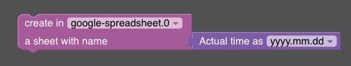

# Create-Sheet
The create-sheet feature allows you to add a new sheet to a Google spreadsheet.

Used API endpoint: https://developers.google.com/sheets/api/reference/rest/v4/spreadsheets/batchUpdate

The feature accepts the title parameter as the name of the new sheet to be added.


## Blockly



In Blockly, the parameter title is passed as the title-parameter to the Google API. This title-parameter is used to name the new sheet that will be added to the spreadsheet.

## Javascript

The given code snippet adds a new sheet to the spreadsheet with the specified title.

```javascript

sendTo(
  "google-spreadsheet", 
  "createsheet",
  "nameOfNewSheet"
);