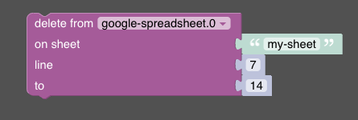

# Delete Rows

The delete-rows feature allows you to delete specific rows from a Google spreadsheet.

Used API endpoint: https://developers.google.com/sheets/api/reference/rest/v4/spreadsheets/batchUpdate

The feature accepts the following parameters:
- `sheetId`: The ID of the sheet from which rows are to be deleted.
- `startIndex`: The index of the first row to delete.
- `endIndex`: The index of the last row to delete.

## Blockly



In Blockly, the parameters `sheetName`, `start`, and `end` are passed to the Google API.

## Javascript

The given code snippet deletes rows from the spreadsheet within the specified range of rows.

```javascript
sendTo(
  "google-spreadsheet", 
  "deleteRows", {  
    "sheetName": "yourSheetName",
    "start": startRow,
    "end": endRow
  }
);