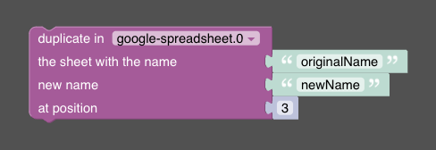

# Duplicate Sheet

The duplicate-sheet feature allows you to create a copy of a specific sheet in a Google spreadsheet. This can be particularly useful when you have a sheet that serves as a template. By duplicating the template sheet, you can preserve the original while working with a copy that retains all the formatting and formulas or even diagrams of the original.

Used API endpoint: https://developers.google.com/sheets/api/reference/rest/v4/spreadsheets/batchUpdate

The feature accepts the following parameters:
- `source`: The name of the sheet to be duplicated.
- `target`: The name of the new sheet.
- `index`: The position where the new sheet should be inserted.

## Blockly



In Blockly, the parameters `source`, `target`, and `index` are passed to the Google API.

## Javascript

The given code snippet duplicates a sheet in the spreadsheet with the specified source sheet name, target sheet name, and index.

```javascript
sendTo(
  "google-spreadsheet", 
  "duplicateSheet", {  
    "source": "originalName",
    "target": "newName",
    "index": 3
  }
);