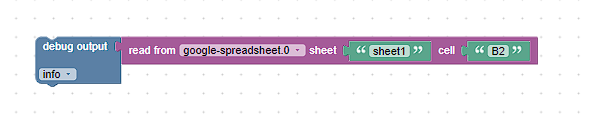

# Read Cell
The read cell feature allows you to read data from a specific cell in a Google spreadsheet.

Used API endpoint: https://developers.google.com/sheets/api/reference/rest/v4/spreadsheets.values/get

The feature accepts two parameters: `sheetName` and `cell`.

## Blockly



In Blockly, the parameters `sheetName` and `cell` are combined to form the range-parameter for the Google API. The range-parameter can accept a sheet name and a cell in A1 notation. For instance, you can use 'Sheet1!A1' to target a specific cell.

## Javascript

The given code snippet reads data from a specific cell in the spreadsheet.

```javascript
sendTo(
  "google-spreadsheet", 
  "readCell", {  
    "sheetName": "nameOfTab", 
    "cell": "A1"
  },
  (response)=>{console.log(response);}
);