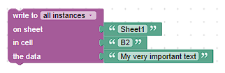

# Write Cell
The write cell feature allows you to write data to a specific cell in a Google spreadsheet.

Used API endpoint: https://developers.google.com/sheets/api/reference/rest/v4/spreadsheets.values/update

The feature accepts three parameters: `sheetName`, `cell`, and `data`. The `data` parameter can be any value that you want to write to the cell.

## Blockly



In Blockly, the parameters `sheetName` and `cell` are combined to form the range-parameter for the Google API. The range-parameter can accept a sheet name and a cell in A1 notation. For instance, you can use 'Sheet1!A1' to target a specific cell.

## Javascript

The given code snippet writes data to a specific cell in the spreadsheet.

```javascript
sendTo(
  "google-spreadsheet", 
  "writeCell", {  
    "sheetName": "nameOfTab", 
    "cell": "A1",
    "data": "Hello, World!"
  }
);
```